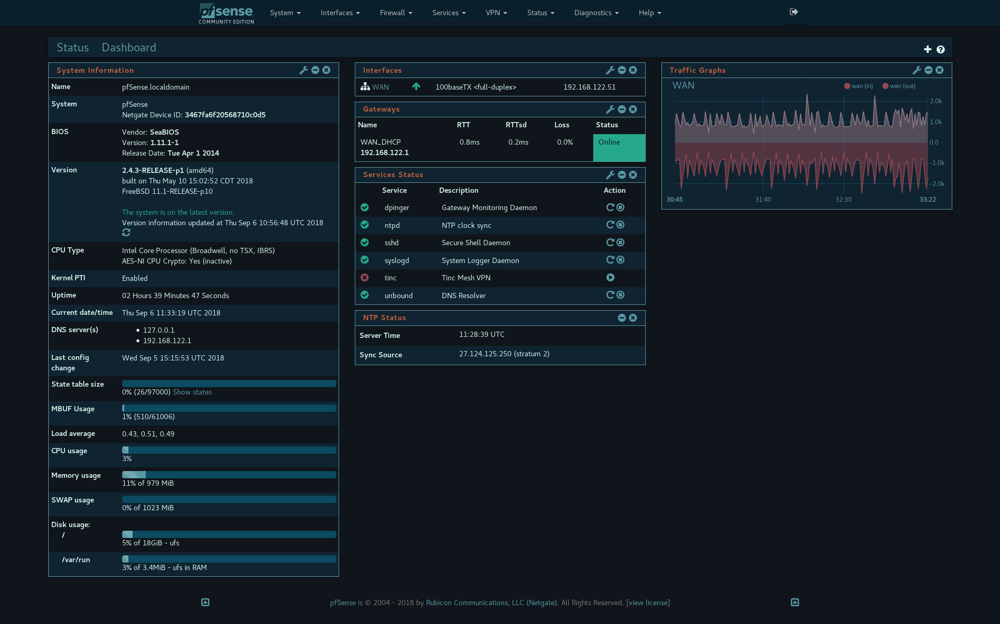
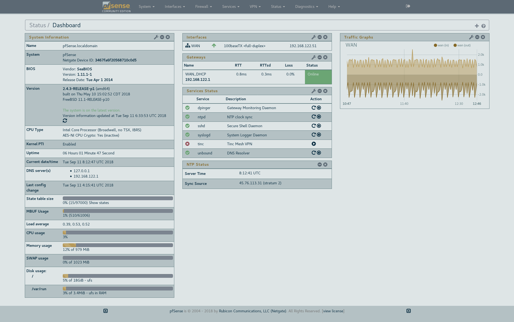

A **very dark** theme for [pfSense](https://github.com/pfsense/pfsense) inspired by [Gotham](https://github.com/whatyouhide/gotham-contrib) colorscheme, now paired with the bright version. Still work in progress.

## Screenshot
 | 
|:---:|:---:|

## To install
1. Enable SSH on pfSense
2. Open pfSense filesystem and copy pfsense-theme-gotham.css and pfsense-theme-gotham-daylight.css to /usr/local/www/css
3. At pfSense settings, go to System -> General Setup then choose pfsense-theme-gotham or pfsense-theme-gotham-daylight at webConfigurator section. Press 'Save' at the bottom of the page then navigate to the main page,